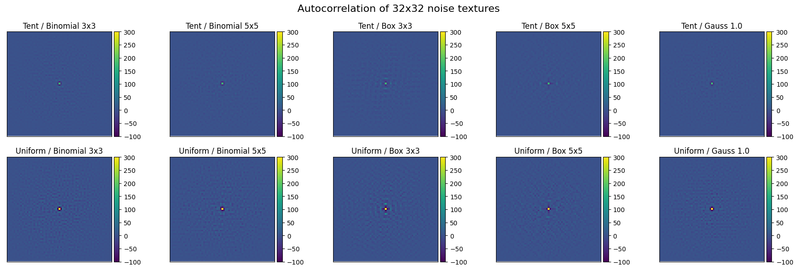
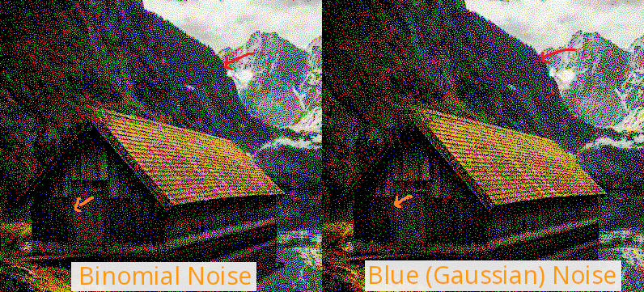
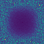
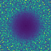
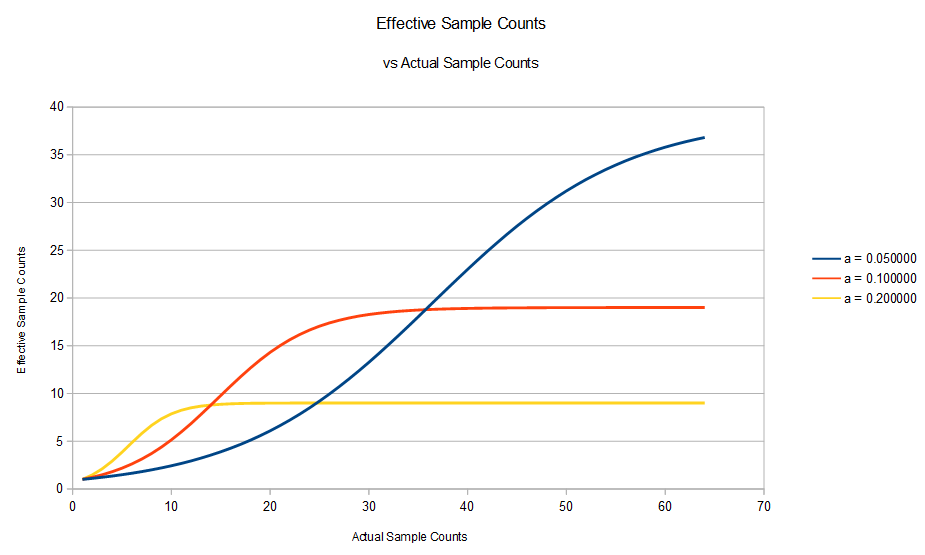

# FastNoise Design and Usage

This document contains information to help you make the best noise for your situation, and how to use it.

## Questions To Consider

1. What Type Should The Pixels Contain?
2. What Spatial Filter Should It Be Optimized For?
3. What Temporal Filter Should It Be Optimized For?
4. Should I Combine Spatial & Temporal Filters Using Product Or Separate?
5. What Width And Height Should The Texture Be?
6. What Depth Should The Texture Be?
7. How To Use The Noise Texture

Bonus: Extra Tricks
<ol type="A">
  <li>More Samples Per Frame</li>
  <li>More Temporal Samples</li>
  <li>Random Direction In Cone & Random Point On Disk</li>
  <li>Is Binomial Noise Better Than Blue Noise, Perceptually or Otherwise?</li>
</ol>

## 1. What Type Should The Pixels Contain?

Whenever you do operations on the pixel values, it degrades their quality.

The pixels should contain the type of values you want, as closely as possible.

Example: It is possible to make a cosine weighted hemispherical unit vector from two scalar values, by having a vector2 noise texture where you read two scalar values per sample.  You will get better quality by using a noise texture with cosine weighted hemispherical unit vector per vector, though.

## 2. What Spatial Filter Should It Be Optimized For?

Your noise should be optimized toward the spatial filter you are using.

If you are not using a spatial filter, you probably want to optimize for “perceptual quality” which means you want to optimize either towards gaussian sigma 1.0, or a 3x3 binomial filter.

We haven’t looked at what the best spatial filter to use might be. You want to choose one you can afford, and looks acceptable, so it’s situational, but there may be a “pareto frontier” of best choices here, that we don’t yet know.

## 3. What Temporal Filter Should It Be Optimized For?

Your noise should be optimized toward the temporal filter you are using.

There are areas left to explore here:
* If you are not using a temporal filter, it is unclear what the best thing to optimize is for temporally.  It might be that you want red noise over time for better temporal stability.
* Monte Carlo integration can be seen as a very wide box filter.
* Exponential over time does well under Monte Carlo, but we didn’t try other things.

## 4. Should I Combine Spatial & Temporal Filters Using Product Or Separate?

We found that if applying both spatial and temporal filtering of your render result, then "product" is the better choice for lower error.

If you are only doing temporal filtering, and making the noise be optimized for perceptual quality (gauss or binomial) spatially, then "separate" is the better choice for preserving the perceptual qualities of the source noise.

## 5. What Width And Height Should The Texture Be?

Rule of thumb:
* If you see tiling in the rendering, increase width and height.
* Otherwise, you can try reducing the width and height.

The right width and height is situational, but we have found good results with 64x64 and 128x128.

## 6. What Depth Should The Texture Be?

If you are using temporal anti aliasing with an alpha of 0.1, then a depth of 32 should be enough to reach the maximum effective sample count [1].

If using Monte Carlo integration, you may need a lot of samples. Check out the “More Temporal Samples” slide.

If you are not temporally sampling, it’s unknown what is best for animating the noise over time (a human perception topic). You could make a texture with depth of 1 and do the last bullet point’s offsetting to make it be white noise over time.

## 7. How To Use The Noise Texture

If you are at pixel (px, py) at frame f, with a noise texture that is WxHxD, you should read the pixel at (px % W, py % H, f % D).

This tiles the noise texture over both space and time.

The noise is optimized in a toroidal “wrap around” space, so tiles well in general.

## A. More Samples Per Frame

N samples per frame are sometimes desired.

You can read N ~maximally spaced samples by reading at (((px,py) + R2(index)) % (W,H), f % D). R2 is the low discrepancy sequence from Martin Roberts[2]. This simulates having N independent noise textures. These samples are white noise to each other, but over space and time, the noise texture properties are good.

Below shows the autocorrelation of various 32x32 noise texture types. Moving away from the center of each by a few pixels goes to zero correlation, which means that
reading two pixels that are separated by a few pixels in distance are uncorrelated, simulating N independent noise textures. The closer you get to the edge of the image, the less correlation there is, meaning that reading N ~maximally spaced samples should give best results.


You can also advance time faster by reading at (px % W, py % H, (f * N + index) % 64). These samples have the same time axis relationship to each other that the pixels in the noise texture does.  The textures are “progressive” over time so this is fine for spatial and temporal results.

## B. More Temporal Samples

A texture has a finite depth D, but sometimes we want more than that number of samples per pixel over time.

One way to do this is to read at ((x + offsetx) % W, (y + offset) % H, sample % D), where (offsetx,offsety) is a white noise vector from an RNG seeded with int(sample / D).  This makes there be a “temporal discontinuity” every D frames but gives you a large number of samples temporally.

A bijection could be used instead of an RNG, to make the offset visit all pixels before repeating, for better results.

## C. Random Direction In Cone & Random Point On Disk

If you need a uniform random direction in a cone, one way to get this is to get a random point on a disk, and scale / translate the disk relative to the ray origin to make the specific cone you want.

We don't have any "Random Point On Disk" noise, but If you recall, you can make cosine weighted hemispherical samples by making a random point on disk to make the x and y, and then making the z value be what is needed to make it a normalized vector3.  This works in reverse too.  You can take a cosine weighted hemispherical vector and throw out the z to get a uniform point on a disk, which you can then use to make a direction in a cone.

So, for either of these cases, you can use the cosine weighted hemispherical noise textures, and only read the .xy from it, ignoring the .z.

## D. Is Binomial Noise Better Than Blue Noise, Perceptually or Otherwise?

While experimenting with different filters, we noticed that noise optimized for a 3x3 binomial filter would sometimes make what seemed to be better perceptual
error renderings than sigma 1.0 gaussian optimized blue noise would make.  This can be seen below where the portion highlighted by the red arrow differs between the two.
In the blue noise dither, the pixels are connected and look "wormy", compared to binomial n the left, where the pixels are more evenly spaced and not touching.



Some intuition for this comes from the DFTs below.  Where blue noise is round (isotropic), binomial looks like a rounded circle which attenuates the lowest frequencies
of the corners.  While the radius of the blue noise circle could be increased by decreasing the sigma, the rounded circle of binomial will be able to suppress higher
corner frequencies before hitting the edge (nyquist).

While the blue noise cutoff frequencies are equidistant from the center (DC), binomial cutoff frequencies are close to being quidistant from the edge (nyquist).  It could be that this is another type of isotropy which helps perceptual image quality.

Binomial Noise DFT:



Blue (Gauss) Noise DFT:



It should be noted that in sparser pixel locations, such as where the orange arrow is pointing, that blue noise seems to win compared to binomial for giving
a uniform distribution of points.  One thought on why this might be is that the gaussian kernel is larger, allowing it to control the interaction between
pixels over larger distances.

More investigation is needed!

## References

1. “Amortized Supersampling” by Yang et al, 2009.
https://hhoppe.com/supersample.pdf
Equation 8 in section 4.2.1 has the formula for calculating effective sample counts under TAA. Alpha of 0.1 gets ~19 effective samples at ~32 actual samples.
Graph made with: https://gitlab.ea.com/awolfe/isampler/-/blob/main/TAAEffectiveSampleCounts/main.cpp



2. “The Unreasonable Effectiveness of Quasirandom Sequences” Martin Roberts 2018.
http://extremelearning.com.au/unreasonable-effectiveness-of-quasirandom-sequences/
The R2 sequence generalizes the 1D golden ratio low discrepancy sequence to 2D.
Being a low discrepancy sequence, if you plug in indices [0,N) you’ll get N points that are ~maximally spaced from each other.

```
// R2 is from http://extremelearning.com.au/unreasonable-effectiveness-of-quasirandom-sequences/
// R2 Low discrepancy sequence
float2 R2(int index)
{
	static const float g  = 1.32471795724474602596f;
	static const float a1 = 1 / g;
	static const float a2 = 1 / (g * g);
	return float2(frac(float(index) * a1), frac(float(index) * a2));
}
```
